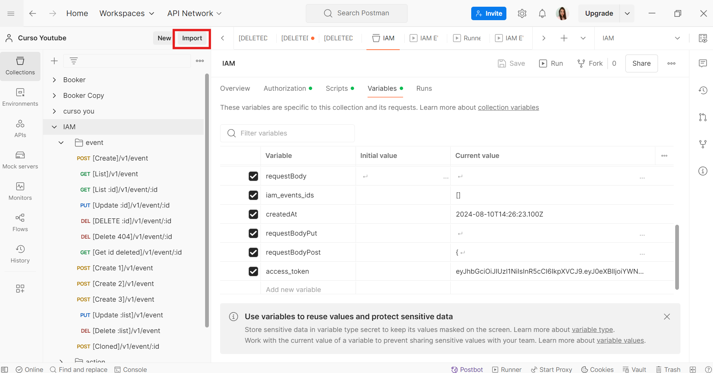
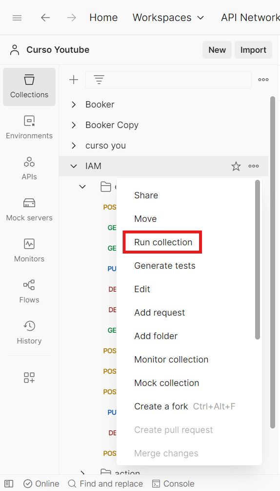

# Testing-IAM-with-Postman
This project includes automated testing performed with Postman. Newman is also used.

To perform the following steps, you should use [IAM.postman_collection.json](IAM.postman_collection.json) and [IAM.postman_environment.json](IAM.postman_environment.json) files.

## Postman
**Import the collection:** Click on the button Import, look at the next picture.



**Run the collection:** Click over the collection name, select the opction "Run collection", look at the next picture.



## Newman

To run the test in Newman, open cmd into the directory where is located the file an run the next command:

``` newman run [collection_name.json] ```

The above command will allow you to get a report in the console of all the tests defined in the collection.
By adding the `-r` command to the end of the line plus one of the following options we can get other reports in Newman:
- `cli` shows the results in the console (it is by default).
- `html` generates a report in HTML format, saved as report.html. First you should install newman-reporter-html. You can do it with the command: 
`npm install -g newman-reporter-html`
- `json` generates a report in JSON format, saved as report.json.
- `htmlextra` this reporter provides rich HTML output that offers a more detailed and stylized view of the results of the collection run. 

For example:
```bash
newman run [collection_name.json] -e [enviroment_name.json] -r html --reporter-html-export [full_path_to_file.html]

newman run IAM.postman_collection.json -e IAM.postman_environment.json -r html --reporter-html-export C:\Users\HP\Documents\git\Testin-IAM-with-Postman\rsc\reportHtml.html```

[reporteHtml.html](./rsc/reporteHtml.html)

- ``` newman run [collection_name.json] -e [enviroment_name.json] -r json --reporter-json-export [full_path_to_file.json]```

```newman run IAM.postman_collection.json -e IAM.postman_environment.json -r json --reporter-json-export C:\Users\HP\Documents\git\Testin-IAM-with-Postman\rsc\reportJson.json```

[reporteJson.json](./rsc/reportJson.json)

- ``` newman run [collection_name.json] -e [enviroment_name.json] -r htmlextra --reporter-htmlextra-export [full_path_to_file.html]```

```newman run IAM.postman_collection.json -e IAM.postman_environment.json -r htmlextra --reporter-htmlextra-export C:\Users\HP\Documents\git\Testin-IAM-with-Postman\rsc\reportHtmlExtra.html```

[reporteHtmlExtra](./rsc/reportHtmlExtra.html)


